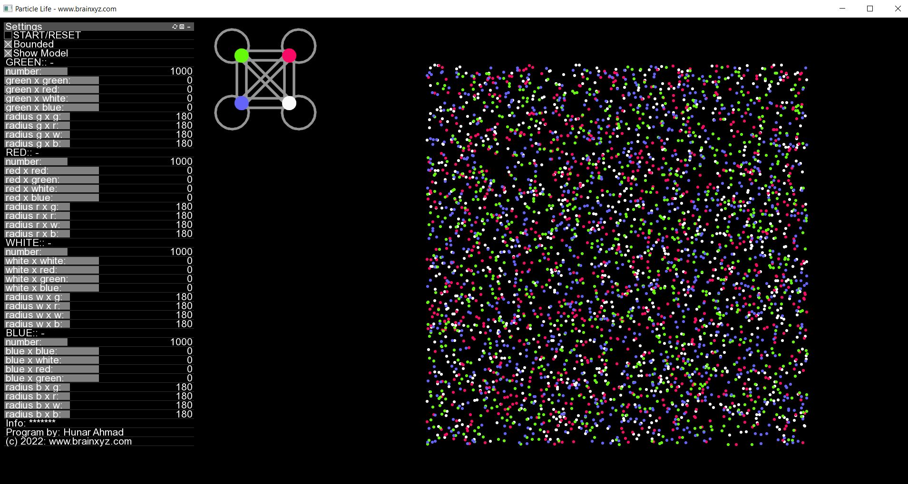
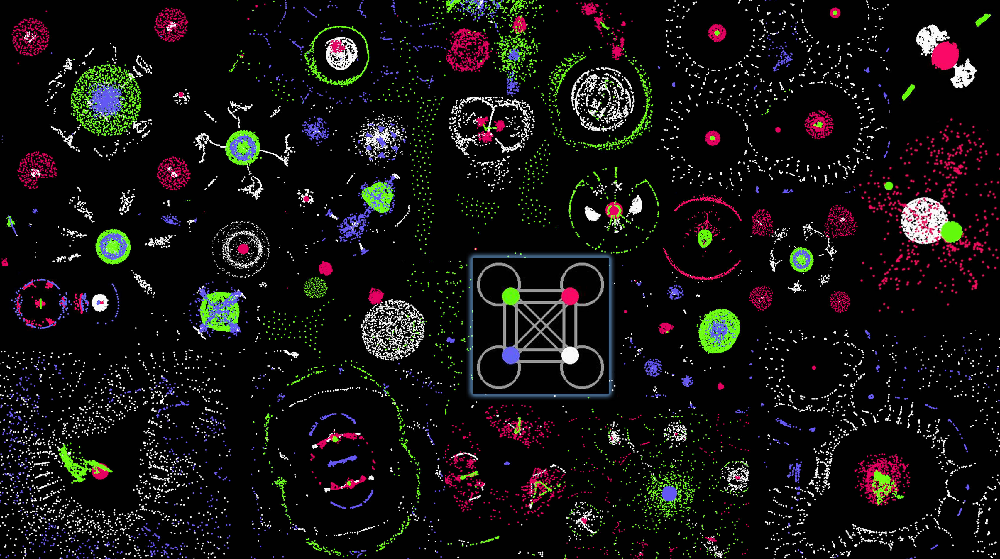
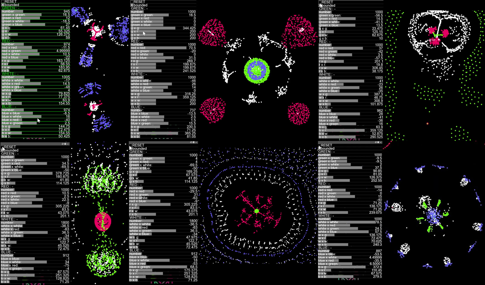

# Particle Life Simulation
A simple program to simulate primitive Artificial Life using simple rules of attraction or repulsion among atom-like particles, producing complex self-organzing life-like patterns. Excluding the GUI elements, the code is less than a page. The video tutorial and walkthrough are available below.

Learn More Here (YouTube video tutorial):
-----------------------------------------------
https://youtu.be/0Kx4Y9TVMGg

Online Demo (JavaScript version):
-------------
Click here for a live demo (JavaScript): 
  - 2d - https://hunar4321.github.io/particle-life/particle_life.html
  - 3d - https://hunar4321.github.io/particle-life/particle_life_3d.html
  
Interface (C++ version)
--------------------------------------------------------


Example Results
--------------------------------------------------------


Some Interesting Patterns to Reproduce:
-------------------------------------
You do not need to be exact with the parameters to reproduce these patterns. The best way to get interesting patterns is to first try random parameter explorations, once you find an interesting pattern, try fine-tuning it gradually. To avoid becoming stuck at a local maximum, you can make some occasional big parameter jumps. In this way interesting and different patterns shall keep poping up.



To use:
-------------
Download this repo. unzip the file then go to /particle_life/bin/ folder and click on particle_life.exe

Code:
----------------
The source code is available in C++, JavaScript, and Python.
Watch this YouTube video for a walkthrough tutorial: https://youtu.be/0Kx4Y9TVMGg

If you would like to contribute to the C++ program, the core algorithm is the first 100 lines of code at:  "/particle_life/src/ofApp.cpp". The rest are GUI components and rendering controls which are provided by the openFrameworks library an opensource and easy-to-use image rendering library.

To start, download this repository then download openFrameworks library from here: https://openframeworks.cc/. Use openFramework's projectGenerator and import /particle_life/ folder to the project.

Alternatively, generate a new openFramework project and add ofxGui. Once the project files are generated replace the /src/ folder with the one provided here.

You can now compile the C++ code on your machine.

Other Ports:
-------------
- [Godot](https://github.com/NiclasEriksen/game-of-leif)
- [Rust](https://github.com/ChevyRay/smarticles)
- [golang](https://github.com/sikora507/go-artificial-life)
- [Lua](https://github.com/ravener/love-life)
- [Webgl](https://github.com/CapsAdmin/webgl-particles)
- [Java](https://github.com/helloimalemur/ParticleSimulation)
- [C# Winforms](https://github.com/BlinkSun/ParticleLifeSimulation)
- [FreeBasic](https://www.freebasic.net/forum/viewtopic.php?p=294331#p294331)

The JavaScript code is as simple as this: 
-------------------------------------
Also, look at the particle_life.html file for a more optimized version - thanks to those who have contributed. 

```html
<canvas id="life" width="500" height="500"></canvas>
<script>
  //Hunar Ahmad @ brainxyz
  m = document.getElementById("life").getContext("2d");
  draw = (x, y, c, s) => {
    m.fillStyle = c;
    m.fillRect(x, y, s, s);
  };
  atoms = [];
  atom = (x, y, c) => {
    return { x: x, y: y, vx: 0, vy: 0, color: c };
  };
  random = () => {
    return Math.random() * 400 + 50;
  };
  create = (number, color) => {
    group = [];
    for (let i = 0; i < number; i++) {
      group.push(atom(random(), random(), color));
      atoms.push(group[i]);
    }
    return group;
  };
  rule = (atoms1, atoms2, g) => {
    for (let i = 0; i < atoms1.length; i++) {
      fx = 0;
      fy = 0;
      for (let j = 0; j < atoms2.length; j++) {
        a = atoms1[i];
        b = atoms2[j];
        dx = a.x - b.x;
        dy = a.y - b.y;
        d = Math.sqrt(dx * dx + dy * dy);
        if (d > 0 && d < 80) {
          F = (g * 1) / d;
          fx += F * dx;
          fy += F * dy;
        }
      }
      a.vx = (a.vx + fx) * 0.5;
      a.vy = (a.vy + fy) * 0.5;
      a.x += a.vx;
      a.y += a.vy;
      if (a.x <= 0 || a.x >= 500) { a.vx *= -1; }
      if (a.y <= 0 || a.y >= 500) { a.vy *= -1; }
    }
  };
  yellow = create(200, "yellow");
  red = create(200, "red");
  green = create(200, "green");
  update = () => {
    rule(green, green, -0.32);
    rule(green, red, -0.17);
    rule(green, yellow, 0.34);
    rule(red, red, -0.1);
    rule(red, green, -0.34);
    rule(yellow, yellow, 0.15);
    rule(yellow, green, -0.2);
    m.clearRect(0, 0, 500, 500);
    draw(0, 0, "black", 500);
    for (i = 0; i < atoms.length; i++) {
      draw(atoms[i].x, atoms[i].y, atoms[i].color, 5);
    }
    requestAnimationFrame(update);
  };
  update();
</script>
```

</br>


Related topics:
Particle Life Simulation,
Primordial Soup - Evolution,
Conway's game of life,
Cellular automata,
Self organzing patterns,

This project was inspired by: Jeffery Ventrella's Clusters http://www.ventrella.com/Clusters/. I do not have access to Ventrella's code but I guess the main difference of this project from the other particle life projects is that I did not implement collision detection and this made simulating thousands of particles possible in real-time. Also, I added GUI controls to change the parameters in real-time allowing easy fine-tuning and exploration, hence, I was able to find some never-seen-before patterns emerge form some extremely simple models of relations. 
The code here is probably an order of magnitude simpler than any other Artificial Life codes out there because I started this code solely as an educational material for non-programmers and general audience to prove the point that complexity can arise from simplicity.


Todos:
--------------------
1. Adding the ability to save and load parameters (so that people can easily share the interesting models they find)
2. Ability to add more particle types (currently it is fixed to four particle types)
3. Currently, the biggest bottleneck is the nested for-loops (which calculate the pairwise distance among all particles) making the computational complexity quadratic. It would be amazing if we could find a way around.
4. Alternative to point 3, computing the pairwise distances are embarrassingly parallel so it can be computed on GPU.
5. Adding the ability to resize the screen and improving boundary-checking as many fast moving particles can escape the screen bounds.
6. Adding a more intuitive UI so that it gives the ability for a finer control over the parameters.
7. Adding a randomize button or, even better, having a simple meta rule to mutate the initial rule continously and recursively. This way the patterns will never get stuck on a local maximum and will keep changing!
8. A better way to fine-tune is to use an evolutionary algorithm to select and optimize the parameters but one needs to write a fitness function for that. I currently don't know what fitness function corresponds to in the realm of this program. In our world the fitness function is competition and survival of the fittest. However, here we fine-tune and select the parameters that produce interesting patterns for us but the word "interesting" is easier to say than to define!

